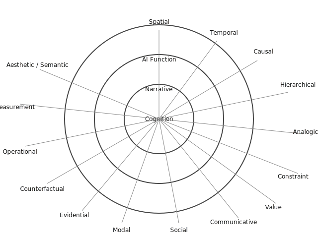

# Adjacency Relationship Types

The HLSF Cognition Engine organizes every edge into a **15-family taxonomy** so downstream reasoning, narrative pacing, and embedding pipelines stay aligned.

## Cognition ⇢ Narrative ⇢ AI Function legend
- **Cognition ring**: internal graph sense-making (attention, evidence, structure).
- **Narrative ring**: story beats, pacing, parallels, and callbacks.
- **AI Function ring**: operational and UX affordances such as embeddings and visualization.

## Families and example relation keys
| Family | Example keys |
| --- | --- |
| Spatial | `adjacency:base`, `adjacency:layer:n`, `∼`, `proximity`, `containment`, `overlap`, `path`, `barrier`, `adjacency:cached`, `adjacency:cached-bridge` |
| Temporal | `before`, `after`, `during`, `recurrence` |
| Causal | `cause`, `effect`, `enablement`, `inhibition`, `⇄`, `⇝`, `↼` |
| Hierarchical | `⊃`, `⊂`, `is-a`, `part-of` |
| Analogical | `≈`, `↔`, `mirror`, `parallel` |
| Constraint | `barrier`, `excludes`, `requires`, `guard` |
| Value | `prioritizes`, `supports`, `penalizes` |
| Communicative | `modifier:emphasis`, `modifier:query`, `modifier:left/right/close/other`, speech-act relations |
| Social | `mentors`, `collaborates`, `opposes` |
| Modal | `can`, `must`, `possible`, `preferred` |
| Evidential | `cites`, `observed`, `demonstrated-by` |
| Counterfactual | `what-if`, `hypothetical`, `contrary-to-fact` |
| Operational | `seed-expansion`, `adjacency:cached` source markers, workflow glue |
| Measurement | `measures`, `estimates`, `quantifies` |
| Aesthetic / Semantic | `self:symbol`, stylistic cues, tone alignments, unlabeled fallbacks |

When a relation key is unknown, the runtime defaults to **Aesthetic/Semantic** so the edge stays visible without blocking ingestion.

## Assigning new relation types
1. Choose the closest family based on intent: structure (Spatial/Temporal/Causal), orchestration (Operational/Measurement/Constraint/Value), or presentation (Communicative/Aesthetic/Social/Modal/Counterfactual/Evidential/Analogical/Hierarchical).
2. Add the mapping in `src/types/adjacencyFamilies.ts` and mirror it in `hlsf_db_tools/adjacency_families.py`.
3. Prefer lowercase, kebab-case relation keys so classification remains deterministic.
4. Unknown keys intentionally fall back to **Aesthetic/Semantic**; only add explicit mappings when the distinction is meaningful for analytics or rendering.

## Minimal visual schema
- **Concentric rings**: Cognition (inner), Narrative (middle), AI Function (outer).
- **15 spokes**: one per family, with micro-icons or glyphs corresponding to relation keys.
- **Legend**: use the prioritization order **Evidential → Causal → Temporal → Operational → Value → Communicative** when summarizing overlays or dashboards.

Use this legend when updating UI affordances, exporting shards, or generating embeddings so the “Think in relationships, not rows…” narrative stays consistent across the stack.
